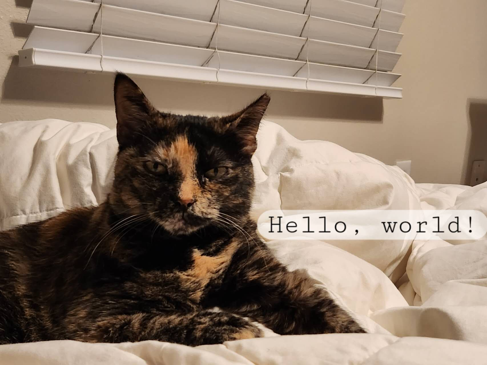

# CSE110 Lab 1
## Welcome to my world


### Styling text:

 This is <sub>megiee</sub> 

 She is _6_ years old

 Apparently, she is a cat with *character*.
 In the eye of megiee, I am an __well-trained__ staff that provide food for her.

 I am a junior year student, and I am interested in database and machine learning.

 I am work with Prof. Ousterhout’s research team on *Analyzing the Usability of Systems for Querying “Eclectic” Data* 


 


### Quoting text:

> I am a cat with character, of course I will wink when I feel hungry.
 


### Quoting code:

```python

while(alive){
    eat();
    sleep();
    feedMegiee();
    code();
    repeat();
}

# Here is the code segment for my sql project
file_path = '../../DataSet/NDJSON_FILES/homogeneous.ndjson'
# Load data from the NDJSON file
with open(file_path, 'r') as file:
    data = [json.loads(line) for line in file]

# Connect to SQLite database
conn = sqlite3.connect('http_logs.db')
c = conn.cursor()

```

### External Links:
Here is my [GitHub Page For CSE110](https://github.com/ruiping-fang/cse110)

### Section links：
[Jump to Welcome to my world](#welcome-to-my-world)

### Relative links 

[Here is link to another .md file](README.md)

### Ordered and Unordered Lists
- Ordered list:

    1. George Washington
    2. John Adams
    3. Thomas Jefferson

- Unordered list
    - George Washington
    * John Adams
    + Thomas Jefferson

### Task lists

- [x] Stay with youself at least for 20 minutes 
- [ ] Enjoy the sunshine
- [ ] Are you smile today?

